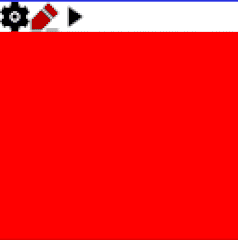

# teensy-gfx-controls
user-interface library for 16-bit color gfx displays
* based on adafruit gfx library 
* targetting 16-bit tft displays 


* [scene controller and menu example](examples/scene_controller/scene_menus.cpp)

## cheatsheet
* build & install for linux
``` shell
> mkdir cmake-build-debug
> cd cmake-build-debug
> cmake .. -DCMAKE_BUILD_TYPE=Debug
> cmake --build .
> cmake --install .
```

* build for teensy
```shell
> mkdir cmake-build-teensy-debug
> cd cmake-build-teensy-debug
> cmake .. -DCMAKE_BUILD_TYPE=Debug -DCMAKE_TOOLCHAIN_FILE:FILEPATH="../cmake/toolchains/teensy41.cmake"
> cmake --build .
```
